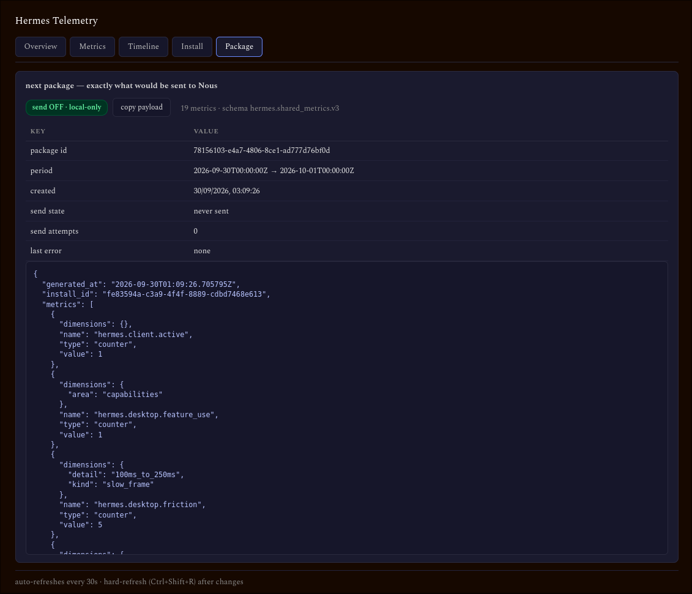
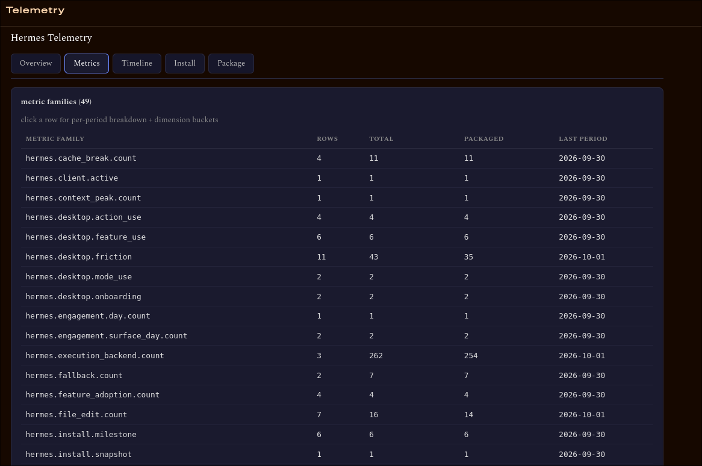

# Hermes Telemetry Dashboard

A plugin tab for `hermes dashboard` that renders the telemetry Hermes collects locally. Inside it you'll see what would go to Nous if sending were enabled: the metric families with drilldowns, the milestone timeline, your install snapshot, and the exact payload of the next queued package.

It reads only. Sending stays off, and nothing in this plugin turns it on.

## Features

- Overview: metric families, event totals, queued packages, send-state badge
- Metric drilldowns: per-period dimension breakdowns, buckets shown as readable ranges
- Timeline: setup milestones and feature flags in order
- Install snapshot: version, OS, architecture, provider, bucket
- Package preview: the next payload in full, ready for inspection before any send

## Install

1. Clone into the plugins directory:

   ```bash
   git clone https://github.com/cybertecla/hermes-telemetry-dashboard.git \
     ~/.hermes/plugins/hermes-telemetry-dashboard
   ```

2. The loader imports `dashboard/plugin_api.py` and expects `router = APIRouter()`. It's already there; no prefix on the router.
3. Add the plugin to `config.yaml` → `plugins.enabled`:

   ```yaml
   plugins:
     enabled:
       - hermes-telemetry-dashboard
   ```

4. Restart the dashboard (`hermes dashboard restart`) and hard-refresh (`Ctrl+Shift+R`).
5. Open the **Telemetry** tab.

## Usage

Open `http://<dashboard-addr>/telemetry`. One screen shows everything Nous would receive if sending were enabled, which makes the tab a kind of transparency layer for the consent decision. The plugin never writes to the telemetry DB and never touches the `send` flag in config.

## Screenshots





## License

MIT — see [LICENSE](LICENSE).
